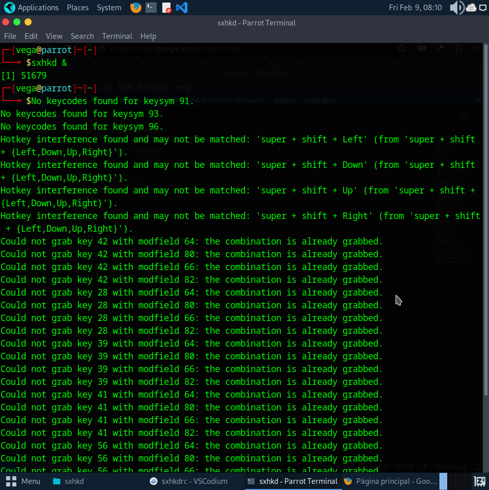
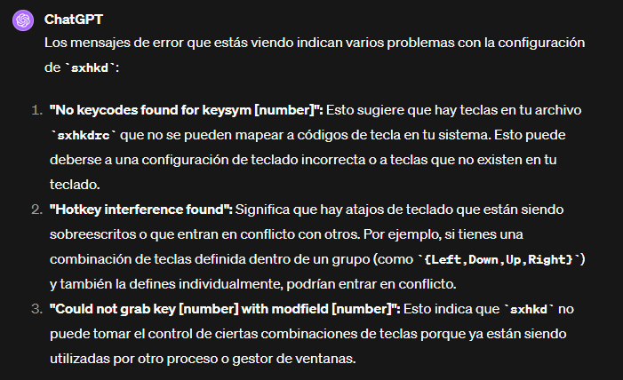
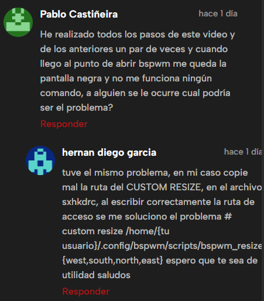

### Explicación inicial
#### No cargan los comandos cuando entro a la interfaz de bspwm.
Queda la interfaz de la pantalla en negro, sin embargo, los comandos custom no cargan. 

---
Busqué estos errores y obtuve como resultado que estoy mapeando las mismas teclas para distintas funcionalidades (?). Eso fue lo que comprendí. 

GPT4 me arrojó estos motivos:

---
Un usuario comenta su solución:

---
No he intentado solucionarlo de esta forma, antes de la clase procuraré intentarlo, aun así, quiero documentar esta posible solución.